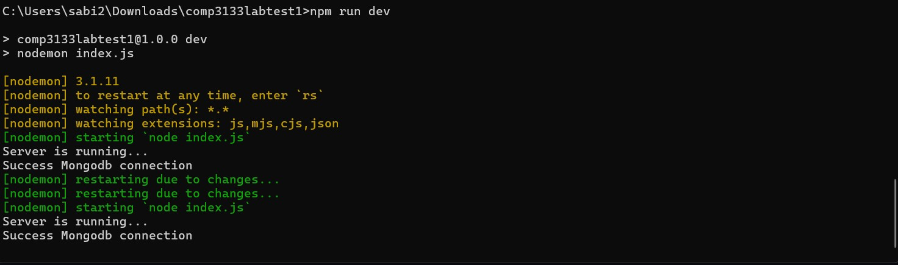
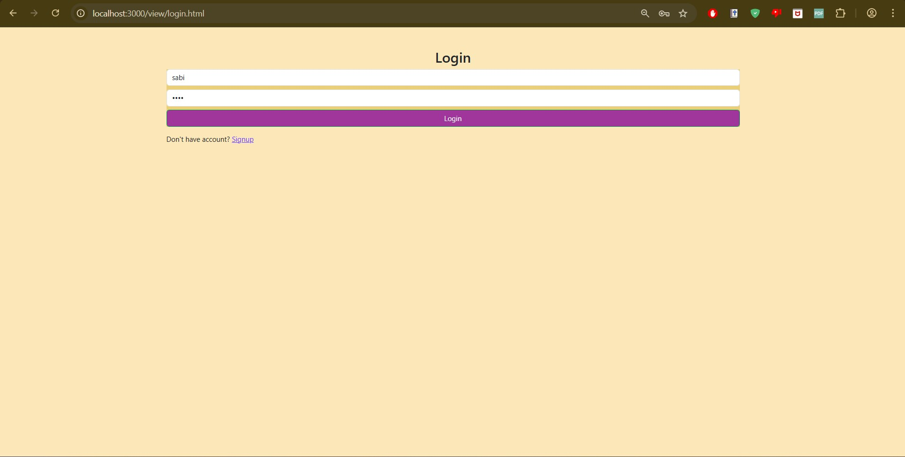
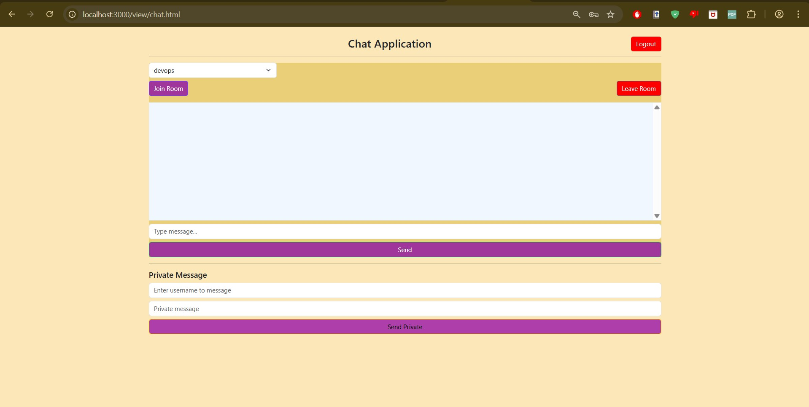
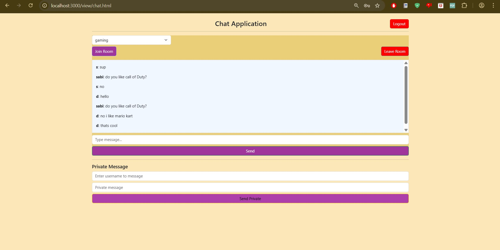
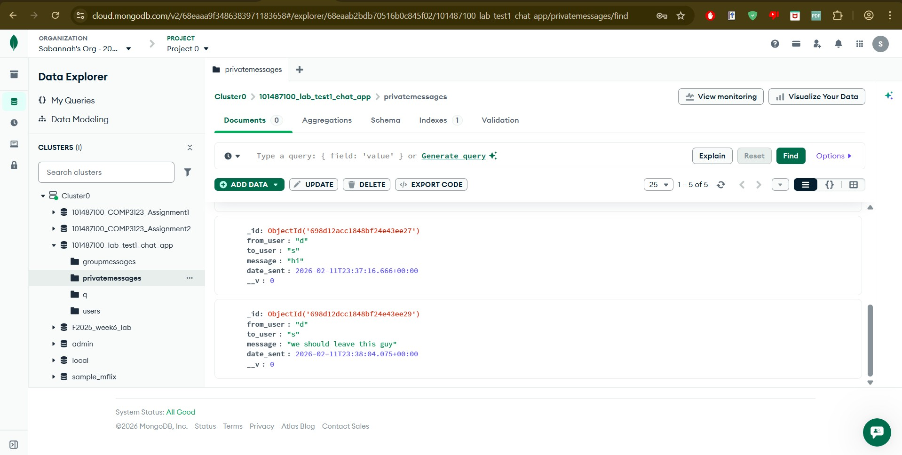
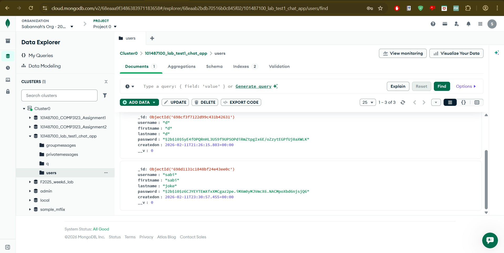

"# 101487100_lab_test1_chat_app" 
how to use:
make an account then login
join room to chat (can't chat until you're in a room)
can only send private message to other people in the same room 

Command line running 

Sign up page

Sign up went through

login

Chat application main page

Error if you message without being in a group

Chat message

Private messages

MongoDb -group messages

MongoDb -private messages

MongoDb -Users
